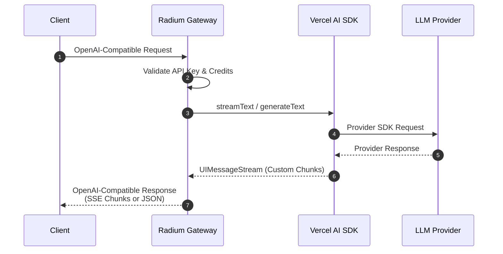

# 🌟 Radium

<div align="center">

**An OpenAI-Compatible AI Gateway with Multi-Provider Support and Credit-Based Billing**

[](https://nextjs.org/)
[](https://convex.dev/)
[](https://www.typescriptlang.org/)
[](https://sdk.vercel.ai/)

</div>

---

## 📋 Table of Contents

- [Overview](#-overview)
- [Architecture](#-architecture)
- [Features](#-features)
- [Getting Started](#-getting-started)
- [Contributing](#-contributing)

---

## 🎯 Overview

Radium is an **AI Gateway** that provides a unified, OpenAI-compatible API endpoint for routing LLM (Large Language Model) requests through various providers. Think of it as a self-hostable alternative to services like OpenRouter or LiteLLM, with built-in:

- **Credit-based billing system**
- **API key management**
- **Usage tracking and analytics**
- **Multi-provider load balancing**
- **Streaming (SSE) and non-streaming responses**

The project leverages **Vercel AI SDK** for seamless integration with different AI providers while maintaining OpenAI API compatibility.

---

## 🏗 Architecture

### Request Flow



---

## ✨ Features

### Core Features

| Feature               | Status | Description                                                                    |
| --------------------- | ------ | ------------------------------------------------------------------------------ |
| OpenAI-Compatible API | ✅     | Near-full compatibility with `/v1/chat/completions` and `/v1/models` endpoints |
| Streaming (SSE)       | ✅     | Server-Sent Events for real-time streaming responses                           |
| Credit System         | ✅     | Pay-per-token billing with user credits                                        |
| API Key Management    | ✅     | Secure hashed API keys with optional limits                                    |
| Usage Tracking        | ✅     | Detailed logging of all completions with timing metrics                        |
| Tool Calling          | ✅     | Full support for function calling and custom tools                             |
| Reasoning Support     | ✅     | Extended thinking/reasoning token support                                      |
| Multi-Provider        | 🔄     | Currently OpenRouter, more providers planned                                   |
| BYOK                  | 🔄     | Bring Your Own Key support (planned)                                           |
| Load Balancing        | 🔄     | Intelligent provider routing (planned)                                         |
| Embeddings            | 🔄     | Embedding model support (planned)                                              |

### Supported Model Features

- **Reasoning Modes**: `high`, `medium`, `low`, (flags such as `minimal`, `none` can be limited to only a few models)
- **Input Modalities**: Text, Image, Audio, Video, File
- **Output Modalities**: Text, Image

---

## 🚀 Getting Started

### Prerequisites

- **Bun** or **Node.js** (v18+)
- **Convex** account and project
- **OpenRouter** API key (or other supported provider)

### Installation

1. **Clone the repository**

   ```bash
   git clone https://github.com/alkalines/Radium.git
   cd Radium
   ```

2. **Install dependencies**

   ```bash
   bun install
   # or
   npm install
   ```

3. **Configure environment variables**

   ```bash
   cp .env.example .env
   ```

   Edit `.env` with your configuration:

   ```env
   Openrouter_API_Key="your-openrouter-api-key"
   AISDK_MaxRetries="0"
   CONVEX_DEPLOYMENT="your-convex-deployment"
   NEXT_PUBLIC_CONVEX_URL="https://your-deployment.convex.cloud"
   NEXT_PUBLIC_CONVEX_SITE_URL="https://your-deployment.convex.site"
   ```

4. **Set up Convex**

   ```bash
   npx convex dev
   ```

5. **Start the development server**

   ```bash
   bun dev
   # or
   npm run dev
   ```

6. **Open the application**

   Navigate to [http://localhost:3000](http://localhost:3000)

---

## ⚙️ Configuration

### Environment Variables

| Variable                      | Required | Description                        |
| ----------------------------- | -------- | ---------------------------------- |
| `Openrouter_API_Key`          | Yes      | Your OpenRouter API key            |
| `AISDK_MaxRetries`            | No       | Max retry attempts (default: 0)    |
| `CONVEX_DEPLOYMENT`           | Yes      | Convex deployment identifier       |
| `NEXT_PUBLIC_CONVEX_URL`      | Yes      | Convex cloud URL                   |
| `NEXT_PUBLIC_CONVEX_SITE_URL` | Yes      | Convex site URL for HTTP endpoints |

### Provider Configuration

To add a new provider, implement the `AIProviderConfig` interface:

```typescript
const NewProvider: AIProviderConfig = {
  name: "Provider Name",
  slug: "provider-slug",
  defaultBaseURL: "https://api.provider.com/v1/",
  policies: {
    trainingOnFree: false,
    trainingOnPaid: false,
    privacy_policy: "https://provider.com/privacy",
    tos: "https://provider.com/terms",
  },
  connector: (Config) => {
    return (model: string, settings?: AIProviderSDK_ModelSettings) => {
      // Return LanguageModel instance
    };
  },
};
```

---

## 🤝 Contributing

Contributions are welcome! Please feel free to submit a Pull Request.

1. Fork the repository
2. Create your feature branch (`git checkout -b feature/AmazingFeature`)
3. Commit your changes (`git commit -m 'Add some AmazingFeature'`)
4. Push to the branch (`git push origin feature/AmazingFeature`)
5. Open a Pull Request

---

## 📄 License

This project is open source. See the repository for license details.

---

<div align="center">

**Made with ❤️ and 😡 by [Alkalines Team](https://github.com/alkalines)**

</div>
