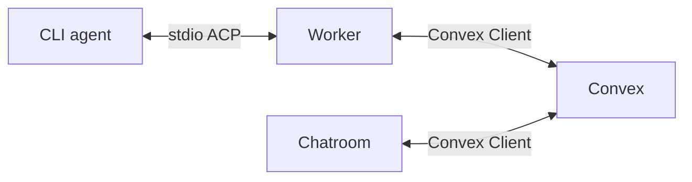

# Worker Transport Through Convex

Decision date: **2026-10-02**. Status: **selected design; machine authentication and
identity subscription implemented locally**, command/approval/output transport remains planned.
This supersedes the Worker-hosted WSS/Tailscale transport recommendation in
[connectivity research](Connectivity.md). Worker and Chatroom both connect
outbound through Convex clients; commands, approvals, output and results pass
through Convex. Direct browser-to-Worker connectivity is not part of this plan.

## Responsibility And Flow

- **Worker** owns subprocesses, local filesystem/terminal capabilities, ACP
  adaptation, output batching and a bounded recovery journal.
- **Convex** owns authorization, durable commands/approvals, session assignment,
  lifecycle transitions, output chunks and saved results.
- **Chatroom** owns conversations, agent configuration, interactive control and
  approval UX. Gateway retains model routing.

Convex's WebSocket carries reactive queries and mutations, not an arbitrary
ephemeral application message bus. Live output delivered through subscriptions
therefore has database persistence and invalidation costs. The design controls
update frequency, bytes, query dependencies and subscriber fan-out.

## Implemented Foundation And Entry Points

`packages/worker/src/cli.ts` starts an authenticated outbound Convex-client
identity subscription through `src/control.ts`. The Worker has no inbound HTTP
listener; enrollment and JWT exchange use outbound requests to Convex-hosted auth
endpoints. See [machine authentication](Machine_Authentication.md).
`packages/worker-component/src/component/` implements enrollment/public-key
identity persistence, retry recovery and revocation, mounted as `workerIdentity`
in `packages/backend/convex/convex.config.ts`. See the
[component contract](Component.md).

Owner/machine identity wrappers and the Worker identity subscription are implemented.
Output persistence, ACP execution and interactive Chatroom integration remain planned. App-owned
queries/mutations authorize callers before accessing the component; clients do
not call component functions directly. Runtime-neutral wire contracts belong in
`packages/backend/src/worker/` when introduced. Current Chatroom entry points
include `packages/backend/convex/chatroom.ts` and
`packages/backend/src/http/aisdk.chat.ts`.

## Machine Authentication And Authorization

Retain owner-authorized, single-use enrollment and a separate key per Worker.
Initially one Worker belongs to one workspace; a workspace can have multiple
Workers. The proposed connection flow is:

1. Worker proves possession of its enrolled private key at a narrowly scoped
   authentication boundary. The app issues a short-lived machine JWT accepted by
   its configured Convex verifier. The selected issuer/audience, ES256 profile,
   challenge admission and refresh protocol are in the machine-authentication guide.
2. One `ConvexClient` per Worker process uses `setAuth()` to obtain and refresh
   tokens. Enrollment keys stay outside executed workloads; no deployment/admin
   credentials or upstream provider secrets are granted to Worker.
3. App queries/mutations derive Worker identity and workspace server-side and
   enforce active identity/epoch, capabilities and session/attempt assignment.
   JWT validity alone does not establish current authorization. Mutations check
   authority in the same transaction as the state transition.
4. Human operations retain Better Auth session validation and current workspace
   and chat checks. Managing a Worker does not grant access to another user's
   personal chat. Initial session policy is one controller plus authorized viewers.

Revocation must invalidate subscribed control state and block subsequent writes
and privileged admission. During control/token/lease loss, stop new privileged
work under an explicit fail-closed policy. Expiry, freshness windows, controller
loss and best-effort process termination need defined contracts; revocation does
not undo an already executed side effect.

## Batch Before Writing

Worker batches locally before calling Convex. Flush on a time threshold, a byte
threshold or an important boundary. These are **initial tuning targets**, not
implemented settings or measured capacity guarantees:

| Traffic                                                    | Initial policy                                                       |
| ---------------------------------------------------------- | -------------------------------------------------------------------- |
| Assistant text                                             | 500 ms default candidate; explore 250–500 ms, with a byte cap        |
| Terminal output                                            | 500–1,000 ms, with bounded batches                                   |
| Progress/status                                            | Coalesce superseded updates to the latest useful state               |
| Approval request/decision, cancellation, error, completion | Immediate authoritative transition                                   |
| Lease renewal                                              | Coarse cadence; piggyback on authorized output writes where possible |

For 100 source notifications/second over 60 seconds, a 500 ms interval yields
roughly 120 output mutations instead of 6,000, assuming byte caps do not flush
earlier. This excludes lifecycle, approvals, renewal, retries and subscription
updates. Batch multiple deltas into one bounded chunk document where appropriate:
one mutation inserting 50 event documents still performs 50 document writes.

Preserve ordering and required ACP requests/responses; only explicitly replaceable
progress is coalesced. Permission decisions are durable and bound to the exact
authorized operation before privileged work proceeds. Chatroom may animate text
locally between batches without pretending uncommitted output is durable.

No configuration names or environment variables are introduced yet. Time/byte
caps, renewal cadence, spool bounds and retention must be explicit in the eventual
Worker configuration and documented alongside implementation.

## Separate Control From Output

The conceptual persistence boundaries are:

| Data                          | Responsibility                                  |
| ----------------------------- | ----------------------------------------------- |
| Worker identity/configuration | Workspace, capabilities, revocation             |
| Session/control records       | Assignment, controller, lifecycle, cancellation |
| Commands/approvals            | Durable intent, admission and decisions         |
| Output chunks                 | Bounded batched text/tool updates               |
| Final messages/artifacts      | Authorized long-term conversation history       |

These are proposed domains, not new schema/table declarations. Keep job/output
storage separate from the identity component until its ownership contract is
defined. A session control document must not contain a growing transcript.

Worker control subscriptions must not read output chunks. Chatroom sidebars read
small summaries, not transcripts; update activity summaries at useful boundaries
rather than each text flush. Selecting a few fields from a large document does
not eliminate the underlying document read or its update dependencies.

Avoid workspace/global mutable sequence counters. Use per-session/stream
sequencing and narrowly scoped indexed ranges so unrelated Workers and sessions
do not contend on shared hot records. High-volume tables need only the indexes
required for access and cleanup; redundant indexes add write/storage overhead.

## Chunk Storage And Subscription Windows

Persist bounded output chunks with session/stream epoch, sequence range and batch
content. Avoid repeatedly patching an ever-growing accumulated message. `patch`
is not an append-only streaming primitive, and documents have a 1 MiB size limit.

Chatroom subscribes to a bounded live window, keeps received chunks locally and
loads older history with indexed pagination. Reconnect catches up missing ranges;
retention gaps require explicit resync from a saved result/checkpoint. Do not
return all output since session creation on every live update.

Use stable subscription arguments and advance windows at page/chunk boundaries,
not per source token. A cursor helps bound reads but constantly recreating the
subscription can increase initial-read work and reduce cache reuse. The exact
window/catch-up contract needs verification for gaps, ordering and slow viewers.

Worker maintains a bounded indexed subscription to its assigned control records,
with additional active-session subscriptions only as needed. Avoid global pending
job scans, changing timestamp arguments and database heartbeats at socket-ping
frequency. Subscription notifications are hints; durable admission/claim remains
an atomic mutation. Queries do not automatically rerun when wall-clock time passes;
lease expiry needs an explicit reconciliation policy.

Chatroom subscribes to live output only where needed and unsubscribes when views
close. Cache reuse can reduce database reads, but different auth contexts/arguments
must not be assumed to share results. Subscription updates and subscriber fan-out
still contribute to load; no idle polling does not mean zero connection cost.

## Recovery, Acknowledgments And Backpressure

- Give batches stable identities and sequence ranges. Ingestion returns the
  committed contiguous position, accepts exact retries and rejects conflicting
  duplicates. Advance a per-stream checkpoint in the batch transaction where
  appropriate rather than making a separate acknowledgment write per delta.
- Journal admitted operations and required output locally. Retain output until
  Convex acknowledges persistence; browser receipt is not the durability boundary.
  Crash-durable guarantees require durable local storage, not just an in-memory
  queue. Host/disk loss before upload remains a recovery limitation.
- Browser delivery acknowledgments are not needed for persistence. A read-position
  feature, if added, can update coarsely under its own access policy.
- Commands use stable operation/attempt IDs and durable intent/admission/result
  records. Reconnect reconciles state instead of automatically repeating a prompt
  or command. A crash between a side effect and its completion record can leave an
  unknown outcome; no exactly-once execution claim is made.
- Bound queues, concurrent uploads, chunk bytes and retained output. Backpressure
  or pause/cancel under policy before exhausting storage. Never silently drop
  permission requests/responses, required output or completion records. Retry
  transient errors with bounded jittered backoff; reconcile authentication failures.

## Retention And Bulk Content

On completion, commit authorized final messages/tool summaries before reporting
durable completion. Keep streaming chunks for a defined recovery/debugging window,
then remove them in bounded background batches. Exact retention durations and
cleanup scheduling are open; no retention implementation is implied.

Large completed artifacts or intentionally retained transcripts can use Convex
file storage, with authorized metadata and retrieval. Verify the file-serving
access contract before choosing URL delivery; a storage reference alone is not
chat authorization. Keep live text in database chunks rather than rewriting files
for each update. Output content is conversation data, not operational logs;
reasoning/terminal capture needs explicit content and retention policy.

## Reuse Decision

[Convex Orchestrator](https://www.convex.dev/components/akshatgiri/convex-orchestrator)
remains a reference for durable claims/leases, not the Worker runtime or transport.
Its workflow-oriented model and missing built-in Worker authentication do not
cover this interactive session boundary. No adoption is planned in this slice.

The [Convex Agent streaming guide](https://docs.convex.dev/agents/streaming)
demonstrates throttled delta persistence and chunking. Reuse those patterns without
assuming adoption of its agent runtime. The prior component/catalog evaluation is
in [authentication research](Authentication.md); `convex-helpers` remains suitable
for app wrappers, not a machine issuer or execution platform. This decision adds
no dependency.

## Next Slice And Verification

Implement an **authenticated Worker Convex Client + stdio ACP test agent + batched
output subscription + durable permission round trip**. Real filesystem/command
capabilities require the separate execution-isolation contract in
[task 06](../tasks/06_Chatroom_Worker.md). Deployment packaging belongs to task 09.

Measure idle, active, multi-session, multi-viewer, slow-client and reconnect cases:

- Mutations/second, document/index bytes written and retained storage.
- Query reruns, bytes scanned/read/returned, subscription update fan-out.
- Mutation conflicts/retries, queue growth, catch-up size and user-visible latency.
- Worker/client connection counts and token refresh overhead.

Verify cross-workspace/private-chat denial, revocation, token expiry, control
outage, duplicate batches, conflicting retries, lost acknowledgments, sequence
gaps, process restart, cancellation and ambiguous command admission. Verify ACP
capability negotiation, bidirectional permission calls and stdout/stderr separation.

Current Cloud accounting includes subscription updates as function calls. Cached
query reads avoid database bandwidth charges, not all costs. Cloud limits/pricing
are deployment-specific; self-hosted operation still needs capacity measurements.
No scale or cost guarantee follows from the initial batching targets.

## Sources

- [Convex realtime and caching](https://docs.convex.dev/realtime)
- [Best practices](https://docs.convex.dev/understanding/best-practices)
- [Limits and accounting](https://docs.convex.dev/production/state/limits)
- [Agent delta streaming](https://docs.convex.dev/agents/streaming)
- [Custom JWT authentication](https://docs.convex.dev/auth/advanced/custom-jwt)
- [ConvexClient API](https://docs.convex.dev/api/classes/browser.ConvexClient)

Official documentation was consulted for this decision. Exact auth, batching,
schema and recovery contracts remain implementation and verification work.
