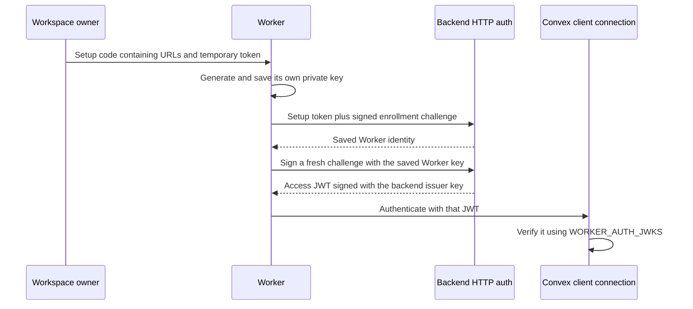

# Worker Machine Authentication

Status: **implemented locally, deployment integration unverified** (2026-10-04).
This is the selected authentication profile for the [Convex transport](Convex_Transport.md).
It uses the existing [identity component](Component.md); it does not create human
accounts, Gateway API keys or deployment credentials for Workers.

## The Short Explanation

There are **three different credentials**, with different jobs:

1. **Setup token:** the temporary secret inside the frontend's setup code. It
   authorizes one Worker to join a workspace. It expires after ten minutes.
2. **Worker key pair:** generated automatically by that Worker. The private key
   stays on its machine; the backend remembers its public key. Signing a fresh
   challenge proves that the same machine is asking to authenticate again.
3. **Backend issuer key pair:** generated once by the operator for a deployment.
   The backend uses its private key to sign five-minute access tokens. Convex
   uses the matching public key to accept those tokens on its client connection.

`WORKER_AUTH_PRIVATE_JWK` and `WORKER_AUTH_JWKS` configure **number 3**.
You do not generate these variables again for each Worker. Each Worker takes care
of number 2 during its own setup.

**JWK** means a key represented as JSON. **JWKS** means a JSON key set, shaped
like `{"keys":[publicKey]}`. **JWT** is the signed access token the Worker sends
to Convex. A **challenge** is a short-lived statement the backend asks the Worker
to sign, so an old signature cannot simply be replayed. The **identity epoch**
is a version number: revocation advances it, and older tokens no longer match.



For reading the code, start at:

- `packages/backend/convex/workers.ts`: owner management and transactional
  enrollment/challenge/authorization policy.
- `packages/backend/src/http/worker.ts`: the two HTTP exchanges, with signature
  verification before internal admission.
- `packages/backend/src/worker/auth.ts`: key parsing, signatures and token issuance.
- `packages/backend/convex/auth.config.ts`: how Convex verifies issued tokens.
- `packages/worker/src/auth.ts`: the machine's setup, recovery and token refresh.
- `packages/worker/src/control.ts`: the Convex connection and auth retry lifecycle.

## Linking And Normal Authentication

1. In **Settings > Workspace > Workers**, a workspace owner generates a setup code.
   Better Auth session validation and current owner/archived-workspace policy apply.
   Members cannot create, list or revoke Worker identities.
2. The displayed `radium-worker-v1.` code encodes a versioned JSON bundle with the
   Convex HTTP `backendUrl`, Convex client `convexUrl`, enrollment selector,
   256-bit token and ten-minute expiry. Encoding is not encryption: treat the whole
   code as a secret. The browser holds it only in transient UI state and clears it
   on dismissal, expiry or workspace change; copying is an explicit user action.
3. The Worker persists a new P-256 private key, public key, stable enrollment
   request ID and non-secret recovery context **before** contacting the backend.
   Setup is read through stdin or a protected file, rather than a token argument.
4. An outbound HTTPS challenge request binds the enrollment selector, request ID,
   canonical public key, workspace and operation in an immutable app record.
   The Worker signs the challenge with its private key using ES256 JOSE.
   Only enrollment completion sends the setup token; the component stores its
   SHA-256 hash, never the token. App admission consumes the challenge and component
   enrollment in one mutation transaction. A mismatched selector rolls back both.
5. If a completion response is lost, fresh proof of the same key recovers the
   committed identity using the selector, including after the setup token expires.
   A fresh challenge with the original token/key/request can also complete an exact
   retry. Proof replay is rejected independently of enrollment idempotency.
6. Normal authentication challenges the enrolled key and rechecks current identity
   and epoch transactionally. The app issues a five-minute machine JWT. A single
   Worker `ConvexClient` uses `setAuth` to obtain/refresh these tokens and subscribes
   to `workers.current`. It never receives the issuer's private key. Failed token
   authentication re-arms the same client using jittered exponential backoff with
   a nominal delay increasing from five to sixty seconds; retries remain disconnected.

The private key and recovery state must remain outside future executed workloads.
See [`packages/worker/README.md`](../../packages/worker/README.md) for CLI commands,
state-file permissions, retries and local service behavior.

## Protocol And Authorization

Both HTTP endpoints live on the **Convex site origin**, not Vite:

- `POST /api/worker/auth/challenge`: `{kind:"enroll"|"recover", enrollmentId,
requestId, publicKey}` or `{kind:"token", workspaceId, workerId, keyId}`.
  Response: `{challengeId, expiresAt, audience}`. The token form resolves current
  verification material from the component; asserted workspace/key IDs are selectors,
  not authentication.
- `POST /api/worker/auth/complete`: `{challengeId, proof, token?}`.
  The token is required only for enrollment. Enrollment/recovery return
  `{workerId,keyId,workspaceId,identityEpoch}`; normal auth returns `{token,expiresAt}`.

Proofs are compact ES256 JWTs with protected `typ: radium-worker-proof+jwt`,
`challengeId`, exact site-origin `aud`, `iat` and `exp`. Maximum lifetime/age is
60 seconds, with five seconds of JWT clock tolerance; the database challenge's
60-second deadline has no tolerance. A challenge fixes all operation context
server-side, so a signature cannot be reused for a different enrollment or token
exchange. `jose` imports/verifies P-256 keys, canonicalizes public material and
calculates RFC 7638 thumbprints. Private JWKs and other curves are rejected.
This is a challenge-response JOSE profile, not RFC 9421 HTTP Message Signatures or OAuth.

JWTs have issuer `<CONVEX_SITE_URL>/api/worker`, audience `radium-worker`, Worker
subject, and `kind`, `workspaceId`, `keyId`, `identityEpoch` claims. Convex's custom
ES256 verifier uses the configured public JWKS. `workers.requireWorker` derives
scope from authenticated claims and re-reads workspace archive state, active key
and identity epoch. Future machine control mutations must call this helper in
their state-transition transaction and add capability/assignment authorization.
There is currently no execution authority: newly enrolled Workers have no capabilities.

Owner revocation advances the component epoch. Existing JWT signatures remain valid
until expiry, but `workers.current` and later authorized reads/writes reject the
revoked identity. The subscription observes component state changes; no socket-kill,
process-termination or instantaneous partitioned revocation guarantee is made.

## Configuration

The feature is optional and self-hostable. Human Better Auth configuration stays
in place. Set these in the **Convex runtime**, never `VITE_*`:

| Variable                  | Purpose                                                                                       |
| ------------------------- | --------------------------------------------------------------------------------------------- |
| `WORKER_AUTH_PRIVATE_JWK` | Private P-256 issuer JWK with `kid`; used only for issuance                                   |
| `WORKER_AUTH_JWKS`        | Public JWKS containing the matching `kid` and `alg: ES256`; must not contain private material |
| `CONVEX_SITE_URL`         | Built-in HTTP action origin; proof audience and issuer base                                   |
| `CONVEX_CLOUD_URL`        | Built-in Convex client origin included in setup bundles                                       |

For self-hosted installations, ensure the backend's built-in origin configuration
advertises addresses reachable by the Worker. The bundle includes both addresses
explicitly; no `.site` to `.cloud` hostname rewriting is used. HTTPS is required
except for loopback HTTP development. Worker clients refuse redirects.

### Generate The Two Environment Values

From the repository root, generate the deployment's issuer key pair:

```bash
bun run --cwd packages/backend scripts/generate-worker-auth-keys.ts "$HOME/.radium-worker-issuer"
```

The directory must not exist. The script creates it with mode `0700` and writes
two files with mode `0600`. It prints their directory, not their contents.

| Generated file                                 | Environment variable      | Value to supply                                     |
| ---------------------------------------------- | ------------------------- | --------------------------------------------------- |
| `$HOME/.radium-worker-issuer/private.jwk.json` | `WORKER_AUTH_PRIVATE_JWK` | The entire JSON object in the file                  |
| `$HOME/.radium-worker-issuer/public.jwks.json` | `WORKER_AUTH_JWKS`        | The entire `{"keys":[...]}` JSON object in the file |

Both files come from the **same** generation run and share a `kid` (key identifier).
The private file includes the secret `d` field; the public file does not. Supply
JSON contents as the values, not file paths, and do not add an extra JSON-string
encoding around those contents.

For a deployment selected by the backend package's Convex CLI configuration:

```bash
cd packages/backend
bunx convex env set WORKER_AUTH_PRIVATE_JWK --from-file "$HOME/.radium-worker-issuer/private.jwk.json"
bunx convex env set WORKER_AUTH_JWKS --from-file "$HOME/.radium-worker-issuer/public.jwks.json"
```

These commands set deployment variables when **you run them**. They have not been
run by the implementation session. The installed Convex CLI supports `--from-file`
for a single variable, so its contents do not need to be pasted into shell arguments.
Alternatively, add the two variables through the Convex dashboard using the same
file contents. For self-hosted operation, use the intended backend deployment's
environment configuration; no hosted issuer is involved.

### Where The Variables Are Used

- `convex/convex.config.ts` mounts components. The `workerIdentity` component does
  not read these issuer variables, so there is no `app.use(..., { env: ... })`
  mapping for them. Its persistence functions receive already-verified data.
- `src/worker/auth.ts` reads deployment variables via `process.env` when the parent
  app creates setup codes or signs access tokens.
- `convex/auth.config.ts` reads `WORKER_AUTH_JWKS` to configure the public JWT
  verifier. Without it, only the existing human Better Auth verifier is configured.

The current app uses direct `process.env` reads, rather than optional typed root
`defineApp({ env: ... })` declarations. A component env mapping is a different
mechanism: it grants variables to that component, and is not required for these
parent-app reads. Neither declaring nor mapping a variable generates its value.

Keep the generated files outside the repository. Changing the public verifier requires
applying Convex auth configuration through your normal authorized deployment;
setting a runtime variable alone does not prove a deployed verifier was refreshed.
Issuance fails closed if the configured public and private keys disagree.

No external issuer, hosted key service or collector is required. Public JWKS is
embedded as a data URI in `auth.config.ts`; no JWKS HTTP endpoint is needed.

## Persistence, Limits And Failure Behavior

- The component remains the owner of token hashes, enrollment receipts, workers,
  public keys and epochs. Its contract and generated API are unchanged.
- App `worker_enrollments` maps an opaque selector to an authorized workspace and
  component receipt. It stores no token or public/private key.
- App `worker_auth_challenges` stores immutable public proof context with indexed
  expiry. Successful admission deletes the challenge atomically; invalid signatures
  never consume it. A cron removes up to 200 expired challenges per minute, above
  the global challenge-creation budget.
- Existing Rate Limiter component bounds successful enrollment creation to 10 per
  workspace/minute and challenge creation to 120 globally/minute. Invalid rolled-back
  operations do not consume these transactional quotas. This initial global cap
  is not a per-IP flood defense; proxy/network admission and fleet tuning remain open.
- HTTP JSON bodies are streamed with an 8 KiB bound; proofs have a 4 KiB bound.
  Responses use `Cache-Control: no-store`; authentication errors collapse to
  `401 {error:"WORKER_AUTH_DENIED"}`. Raw HTTP auth material is not logged.
- Expired or replayed challenges require fresh proof. If token issuance/response
  fails after admission, obtain a new challenge; the key remains enrolled.
- Lost owner issuance responses can leave an unused enrollment until expiry.
  Browser dismissal clears the displayed code; it does not implicitly revoke it.
- Enrollment mapping/receipts and identities are retained indefinitely; the
  component's unused-enrollment cleanup remains explicit. Key rotation and broader
  lifecycle deletion are future work. Owner revoke/re-enroll requires a fresh key.

## Reuse And Verification

The current Convex Components catalog and `convex-helpers` index were reviewed.
Bearer API-key components and OAuth-provider components do not replace the existing
public-key enrollment/recovery boundary. Reuse the existing identity component,
Rate Limiter and `ownedWorkspaceQuery`/`ownedWorkspaceMutation` helpers, which retain
Better Auth validation. Challenge records are app-specific authorization context;
they do not extend the identity component's public API. `jose` is the only new
cryptographic dependency; no handwritten signing or JWT verifier was introduced.

Backend handler regressions cover owner/member/anonymous boundaries, real ES256
proof verification, audience/key/context mismatch, replay, token-free expired-setup
recovery, selector rollback, revoke-between-challenge-and-admission, machine claims,
workspace archive and token issuance. A cross-package regression runs the real
Worker enrollment/token client against app handlers with an independently generated
Worker key, including owner revocation. Worker tests also cover local persistence,
control disconnection and auth retry/shutdown behavior separately.

```bash
bun run --cwd packages/backend test convex/workers.test.ts
bun run --cwd packages/worker test
bun run --cwd packages/worker typecheck
bun run --cwd apps/web vite:build
```

No functions, auth configuration or migrations were uploaded in this slice.
Actual Convex JWT verification, reactive revocation, TLS/proxy routing and recovery
across separately deployed processes still require deployment integration testing.
Commands, ACP, approvals, filesystem/process execution, output and isolation remain
the next [task 06](../tasks/06_Chatroom_Worker.md) slice.
