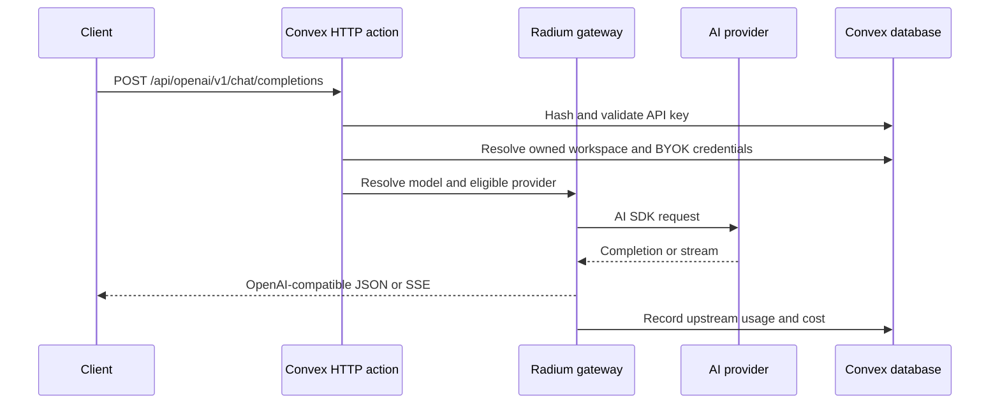

# Architecture

Radium has two application runtimes: a TanStack Start web server and a Convex
backend. The browser uses both of them.

## Runtime Boundaries

### TanStack Start

The Vite-built TanStack Start application owns page rendering and frontend
server routes. File routes live in `src/app/`, with the route directory set in
`vite.config.mts`. `src/router.tsx` connects TanStack Router, React Query, and
Convex React Query.

The auth proxy at `src/app/api/auth/$.ts` connects the web origin to Better
Auth. It is separate from the gateway API.

### Convex

Convex owns persistent data, authenticated functions, workspace authorization,
provider selection, usage, and public HTTP APIs. `convex/http.ts` registers the HTTP routes;
the OpenAI-compatible implementations are in `convex/http/`.

Consequently, gateway clients call the Convex site origin from
`VITE_CONVEX_SITE_URL`. They do not call the Vite server on port 3000.

## Completion Flow

The built-in chatroom uses `POST /api/aisdk/chat`. That handler calls the same
internal completion flow and translates it to an AI SDK UI message stream.

## Provider And Model Data

Global model identity metadata is stored in `models`. The global `providers`
table is a catalogue; workspace configuration snapshots contain the endpoint,
adapter, supported models, pricing, and supported parameters used at runtime.
Workspace provider/model mutations do not replace global catalogue records. A
model is routable only when:

- its global model record exists;
- an enabled local provider configuration offers that model slug; and
- the active workspace has credentials for that provider.

Provider credentials are scoped to a workspace and stored through the Convex
Secret Store component. The regular Convex tables contain only non-secret
metadata and masked previews.

The current gateway is BYOK-oriented: users configure upstream provider
credentials in the Gateway UI. Completion recording stores upstream token cost
and usage; it does not require or debit prepaid credits.

## Authentication And Keys

Better Auth protects the application UI and user-owned Convex functions.
Gateway HTTP clients authenticate separately with a `rad-sk-...` bearer token.
Only a SHA-512 hash and masked preview of each gateway key are persisted; the
plaintext key is returned once when created.

Personal workspaces own gateway keys, provider credentials, completions, and
telemetry. Legacy balance-owned records remain readable during migration. Code
handling those records must verify ownership from the server-side auth identity
rather than trusting a client-provided user identifier. See [Gateway ownership](Radium_Gateway/Ownership.md).

## Chat Scopes

New Chatroom chats have an explicit scope. `personal` chats are private to the
creator. `workspace` chats use the workspace audience; that audience currently
contains only the personal workspace owner because organization membership is
not implemented. Chat queries and mutations enforce this policy through
`convex/workspaces.ts`. During migration, a chat without an explicit workspace
is accepted only when its legacy balance maps to the authenticated user's
active workspace and its stored `userId` matches that user.

## Telemetry

See [AI telemetry boundaries](Radium_Gateway/Telemetry.md) for the shared Gateway
and Chatroom collector, Convex persistence, and verification limits.

Internal telemetry is opt-in per user. Input and output recording are separate
settings. Trace records are stored in Convex and may also be exported to an
OTLP/HTTP collector when an exporter endpoint is configured.

## Generated Files

Do not manually edit:

- `convex/_generated/`
- `src/routeTree.gen.ts`

Run Convex development/code generation and TanStack Router generation through
the normal project commands instead.
