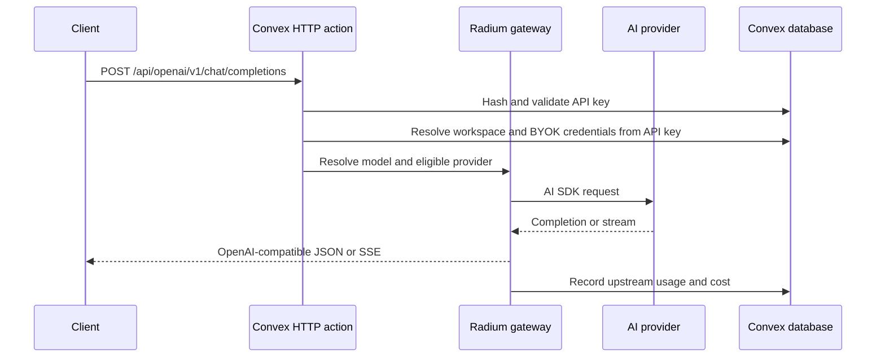

# Architecture

Radium has two application runtimes: a TanStack Start web server and a Convex
backend. The browser uses both of them.

The web application lives in `apps/web/`; Convex functions and components live in
`packages/backend/convex/`. Reusable backend modules live directly under
`packages/backend/src/` by domain (`chatroom/`, `logging/`, `telemetry/`,
`translators/`, `types/`, and `workspaces/`), with provider and routing helpers at
the `src/` root. Web code imports shared contracts from `backend/src/`.

## Runtime Boundaries

### TanStack Start

The Vite-built TanStack Start application owns page rendering and frontend
server routes. File routes live in `src/app/`, with the route directory set in
`vite.config.mts`. `src/router.tsx` connects TanStack Router, React Query, and
Convex React Query.

The auth proxy at `src/app/api/auth/$.ts` connects the web origin to Better
Auth. It is separate from the gateway API.

### Convex

Convex owns persistent data, authenticated functions, workspace authorization,
provider selection, usage, and public HTTP APIs. `convex/http.ts` registers the
HTTP routes; the OpenAI-compatible implementations are in `convex/http/`.

Consequently, gateway clients call the Convex site origin from
`VITE_CONVEX_SITE_URL`. They do not call the Vite server on port 3000.

## Completion Flow

The built-in chatroom uses `POST /api/aisdk/chat`. That handler calls the same
internal completion flow and translates it to an AI SDK UI message stream.

## Provider And Model Data

Global model identity metadata is stored in `models`. The global `providers`
table is a catalogue; workspace configuration snapshots contain the endpoint,
adapter, supported models, pricing, and supported parameters used at runtime.
Workspace provider/model mutations do not replace global catalogue records. A
model is routable only when:

- its global model record exists;
- an enabled local provider configuration offers that model slug; and
- the active workspace has credentials for that provider.

While legacy migration is pending, completion routing through Gateway API keys
and Gateway model listing may use enabled catalogue providers for a
legacy-balance workspace with no local provider configuration rows. Any existing
local row, including a disabled or tombstoned row, disables this fallback and
restores the local-configuration invariant above.

Provider, Exa, and MCP credentials are scoped to a workspace and stored through
the Convex Secret Store component. Regular Convex tables contain only non-secret
metadata and masked previews. Broader application-level encryption is future
work; this document does not claim encrypted workspace records or telemetry.

Provider endpoint configuration is owner-only. Deliberately configured local and
private endpoints are a required self-hosted use case, but the complete
SSRF/private-network policy and configurable egress control remain future work;
see [task 04](tasks/04_Upstream_Instances.md).

The current gateway is BYOK-oriented: users configure upstream provider
credentials in the Gateway UI. Completion recording stores upstream token cost
and usage; it does not require or debit prepaid credits.

## Authentication And Keys

Better Auth protects the application UI and user-owned Convex functions.
Gateway HTTP clients authenticate separately with a `rad-sk-...` bearer token.
Only a SHA-512 hash and masked preview of each gateway key are persisted; the
plaintext key is returned once when created.

Personal workspaces own gateway keys, provider credentials, completions, and
telemetry. Each user may own multiple workspaces, and `workspace_members` grants
explicit member access to existing Better Auth users. Owners manage workspace
resources; members use configured models and shared chats. Legacy balance-owned
records remain readable during migration. Code handling these records must
verify access from server-side auth identity and membership data rather than
trusting a client-provided user identifier. See [Gateway ownership](Radium_Gateway/Ownership.md).

## Chat Scopes

New Chatroom chats have an explicit scope. `personal` chats are private to the
creator, including when the creator is the workspace owner. `workspace` chats
are visible to the workspace owner and explicit members. Chat queries and
mutations enforce this policy through `convex/workspaces.ts`; organization
records are not consulted. During migration, a chat without an explicit
workspace is accepted only when its legacy balance maps to the authenticated
user's active workspace and its stored `userId` matches that user.

Only the chat creator can change `personal` versus `workspace` visibility. An
workspace owner or chat creator can rename, pin, delete,
regenerate its title, and set a per-chat tool override. Workspace defaults,
provider configuration, credentials, API keys, MCP servers, and telemetry remain
owner-managed; users cannot manage another user's personal chat.

## Telemetry

See [AI telemetry boundaries](Radium_Gateway/Telemetry.md) for the shared Gateway
and Chatroom collector, Convex persistence, and verification limits.

Internal telemetry is opt-in per workspace. Input and output recording are
separate settings. General telemetry reads are owner-only and filter traces from
other users' personal chats. Trace records are stored in Convex and may also be
exported to an OTLP/HTTP collector when an exporter endpoint is configured.

## Migration And Generated State

The schema uses a widen-migrate-narrow bridge. Legacy `balances`, `keys`, legacy
attribution fields, and Secret Store namespaces are intentionally retained while
the ownership backfill is pending; the migration does not literally delete the
legacy tables. `@convex-dev/migrations` is mounted and `convex/migrations.ts`
defines `runAll` plus paginated verification queries, but neither the runner nor
deployment verification has been executed.

New workspace-only writes omit legacy required fields, so after those writes
exist the parent schema cannot be redeployed. The cutover is forward-only rather
than rollback-compatible. The audited offline API-only binding generator is
documented in [deployment](deployment.md#offline-api-binding-codegen); it uses
the installed `componentApiDTS` template, writes only
`convex/_generated/api.d.ts`, and does not perform remote component analysis or
deployment verification.

## Generated Files

Do not manually edit:

- `convex/_generated/`
- `src/routeTree.gen.ts`

Use the normal project commands for Convex development and TanStack Router
generation only after checking their target and upload behavior. Use the audited
offline API-only command in [deployment](deployment.md#offline-api-binding-codegen)
when only `api.d.ts` needs refreshing; never hand-edit generated files.
